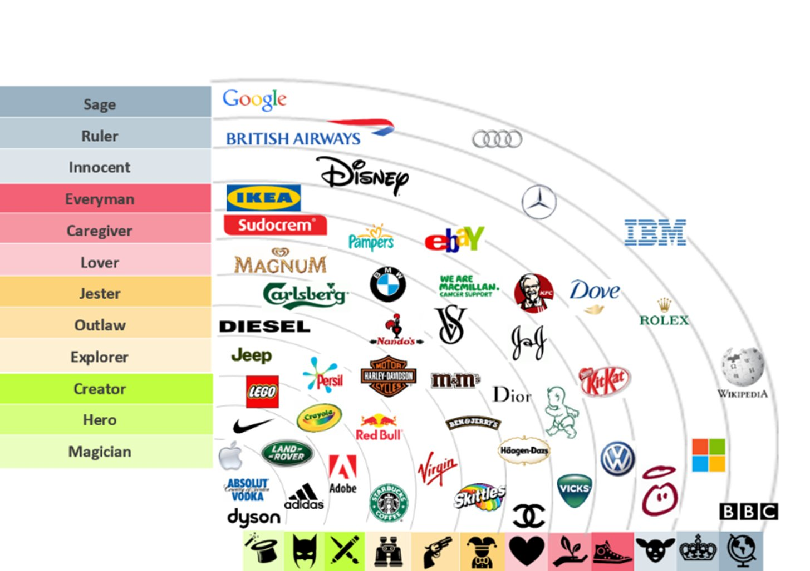
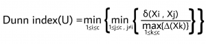

<style>

body {
text-align: justify}

</style>

```{r setup, include=FALSE}
# clear-up the environment
rm(list = ls())

# chunk options
knitr::opts_chunk$set(
  message = FALSE,
  warning = FALSE,
  fig.align = "center",
  comment = "#>"
)

options(scipen = 999)
```

```{r, echo = FALSE, fig.align = "center"}

```


# Background

Brand personality merupakan salah satu faktor yang membuat sesorang membeli suatu produk. Brand satu dengan brand lainnya memiliki karakteristik yang berbeda-beda seperti manusia, misalnya: elegen, sederhana, ceria, ramah dan lain-lain. Konsumen ternyata cenderung membeli produk yang memiliki brand personality yang cocok dengan mereka sehingga inilah yang membuat brand personality menjadi salah satu faktor yang mendorong minat beli konsumen. Brand personality juga merupakan tools bagi perusahaan untuk membedakan produk mereka dengan produk perusahaan lain. Dengan mempertimbangkan aspek personality, penting bagi perusahaan untuk menentukan strategi pemasaran
seperti market segmentation dan brand positioning. Dengan menentukan strategi pemasaran, perusahaan dapat lebih fokus melayani segmen pasar dan mampu unggul dalam persaingan bisnis yang semakin ketat. 

Dikarenakan terdapat sangat banyak brand pada saat ini, besar kemungkinan terdapat brand-brand yang memiliki brand personality yang serupa. Sehingga perusahaan perlu membuat target untuk membangun brand personality yang efektif. Untuk mengetahui persaingan dalam pasar, perusahaan harus mengetahui brand lain mana saja yang kira-kira memiliki brand personality yang serupa. Untuk itu, akan dilakukan clustering untuk menemukan kelompok-kelompok brand yang memiliki personality serupa. Clustering adalah metode machine learning jenis unsupervised yang bertujuan untuk mengelompokan berdasarkan karakteristiknya.


## Analysis Objective 
Tujuan penelitian ini adalah untuk mengetahui kelompok segmentasi brand berdasarkan personality nya, sehingga perusahaan dapat mengetahui persaingan pasar.

```{r, warning=FALSE}
library("dplyr")
library("ggplot2")
library(cluster)    # clustering algorithms
library(factoextra) # clustering visualization
library(dendextend) # for comparing two dendrograms
library(tidyr)     # pivot longer
library(fpc)        # cluster validation
```


# Theory

## Hieararchical Clustering
Pengelompokkan hierarki (hierarchical clustering) adalah metode analisis cluster dengan cara membangun sebuah hierarki kelompok. Strategi untuk pengelompokkan hierarki pada umumnya dibagi menjadi dua jenis yaitu agglomerative (pemusatan) dan divisive (penyebaran). Metode agglomerative (pemusatan) biasanya dipergunakan pada bidang ekonomi dan sosial masyarakat. Adapun algoritma-algoritma pada pengelompokkan hierarki dengan
metode agglomerative (pemusatan) sebagai berikut:

```{r, echo = FALSE, fig.align = "center"}
knitr::include_graphics("assets/Hierarchical-Clustering-Linkages.webp")
```

Hieararchical clustering dibagi menjadi dua, yaitu Agglomerative clustering dan Divisive hierarchical clustering.

1. **Agglomerative clustering** dikenal sebagai AGNES (Angglomerative Nesting). Pengelompokann agglomerative  bekerja dengan pendekatan bottom-up. Artinya, setiap observasi pada data awalnya dianggap sebagai cluster elemen tunggal (leaf). Pada setiap langkah algoritma, dua cluster yang paling mirip digabungkan menjadi cluster baru (node) yang lebih besar. Prosedur ini diulang sampai semua titik menjadi anggota hanya satu cluster besar (root). Hasilnya adalah pohon (tree) yang dapat diplot sebagai dendrogram.

2. **Divisive hierarchical clustering** dikenal sebagai DIANA (penyebaran) dan bekerja secara top-down. Algoritmanya adalah urutan terbalik dari AGNES. Itu dimulai dengan root, dimana semua objek termasuk dalam satu cluster. Pada setiap langkah iterasi, cluster yang paling heterogen dibagi menjadi dua. Proses ini diulang sampai semua objek berada di cluster masing-masing.

Perhatikan bahwa pengelompokan aglomeratif bagus untuk mengidentifikasi kelompok kecil. Pengelompokan hirarkis divisif bagus dalam mengidentifikasi kelompok besar.

## Fuzzy C-Means Clustering
Fuzzy C-Means adalah metode clustering yang pertama kali diperkenalkan oleh Jim Bezdek pada tahun 1981. Fuzzy C-Means mengelompokkan setiap observasi data ke suatu cluster berdasarkan derajat keanggotaannya. 

Algoritma metode Fuzzy C-Means adalah sebagai berikut:

1. Menentukan banyak cluster (k) yang akan dibuat.

2. Menentukan nilai proporsi untuk setiap observasi data secara random untuk masuk dalam suatu cluster.

3. Menghitung nilai pusat cluster ke-j, dengan formula:
$$ C_j =\frac{\sum{u_{ij}^mx}}{\sum{u_{ij}^m}}$$

4. Menghitung kembali nilai proporsi untuk setiap data poin untuk masuk pada setiap cluster. Dengan formula sebagai berikut :
$$u_{ij}^m = \frac{1}{\sum (\frac{|x_i - c_j|}{|x_i - c_k|})^\frac{2}{m-1}}$$


## Cluster Validation: Dunn Coeeficient
Dunn index menilai seberapa rapat anggota dalam suatu cluster dengan variansi yang kecil dan seberapa terpisah cluster yang satu dengan yang lainnya. Cluster yang baik adalah yang memiliki nilai dunn index besar. Formulanya adalah sebagai berikut.
```{r, echo = FALSE, fig.align = "center"}

```

# Read Data
Data yang digunakan pada analisis ini didapat dari paper milik **Jack Hoare & Tim Bock** (2019). Data tersebut merupakan sebuah tabel kontingensi untuk 28 brand dan 15 atribut personality. Data dikumpulkan menggunakan metode nonprobability sampling dari 3173 orang dewasa di Australia pada tahun 2005. Responden diminta untuk menentukan tiga atribut personality untuk setiap brand yang ditunjukkan. Untuk setiap atribut personality, responden ditunjukkan 10 brand.

## Preprocessing Data
Pada data awal, terdapat 16 kolom dengan 1 kolom berisi nama-nama brand ("Brand") dan 15 kolom lainnya merupakan atribut-atribut personality.
```{r}
data_brand <- readxl::read_excel("brand.xlsx")
data_brand <- as.data.frame(data_brand)
```

Nilai kolom brand dijadikan sebagai index row untuk memudahkan visualisasi. selanjutnya kolom "Brand" dibuang. Berikut adalah 6 baris pertama dari data:
```{r}
# meng-assign nilai dari kolom brand menjadi rownames
rownames(data_brand) <- data_brand$Brand

# membuang kolom yang tidak digunakan
data_brand <- data_brand %>% 
  select(-Brand)
head(data_brand)
```

Dapat diperhatikan juga bahwa setiap variabel dari data brand di atas sudah memiliki tipe data yang benar untuk dilakukan clustering, yaitu bertipe data numerik. Selanjutnya akan dilakukan pengecekan apakah terdapat missing values dalam data.
```{r}
anyNA(data_brand)
```
Karena dalam melakukan clustering akan dilakukan perhitungan jarak, maka skala data harus sama. Berikut akan dicek skala data pada data brand:

```{r}
summary(data_brand)
```

Berikut adalah visualisasi dari distribusi data brand untuk melihat lebih lanjut skalanya.

```{r}
data_brand %>% 
  pivot_longer(col = names(data_brand),names_to = "personality", values_to = "values") %>% 
  ggplot(mapping = aes(x = values, y = personality)) +
  ggdist::stat_halfeye(adjust = 0.5,.width = 0, justification = -.2, fill = "pink") + 
  geom_boxplot(.width = 12, colour = "red") +
  theme_minimal() +
  labs(title = "Boxplot for Personality in data  brand",
       y = "",
       x = "Frequency")
```

Karena  terdapat beberapa outlier, diputuskan untuk melakukan scaling agar skala data brand pada tiap variabel sama. Akan dilakukan scaling dengan fungsi `scale()` yang artinya mengubah skala data ke distribusi normal atau disebut juga dengan z-score standarization. Formulanya adalah sebagai berikut:
$$z = \frac{x-\mu}{\sigma}$$
keterangan:

* $x$ : observasi data 
* $\mu$ : mean variabel
* $\sigma$ : standar deviasi variabel

Hasil dari scaling data disimpan dalam objek brand_scale.
```{r}
brand_scale <- scale(data_brand)
```

# Brand Clustering using Hierarchical Clustering

## Agglomerative
Kita dapat melakukan Agglomerative Hierarchical Clustering dengan `hclust` dari package stat (base). Pertama kita menghitung nilai dissimilarity dengan `dist` yang pada case ini dipilih ukuran jarak euclidean dan kemudian memasukkan nilai ini ke dalam `hclust`. Selanjutnya, menentukan metode aglomerasi yang akan digunakan (“complete”, “average”, “single”, “ward.D”).

```{r}
# Dissimilarity matrix
d <- dist(brand_scale, method = "euclidean")

# Hierarchical clustering using Complete Linkage
hc_agg1 <- hclust(d, method = "ward.D" )

# Plot the obtained dendrogram
plot(hc_agg1, cex = 0.6, hang = -1)
```
Sementara itu, kita juga dapat melakukan dengan Hierarchical Clustering agglomerative menggunakan fungsi `agnes()` dari package `cluster`. Secara default, ukuran jarak yang digunakan pada fungsi `agnes()` adalah euclidean. Salah satu kelebihannya adalah bisa didapatkan koefisien agglomerative, yang mengukur jumlah struktur pengelompokan yang ditemukan (nilai yang mendekati 1 menunjukkan struktur pengelompokan yang kuat).

Menggunakan koefisien ini, memungkinkan kita untuk menemukan metode aglomerasi tertentu yang dapat mengidentifikasi struktur pengelompokan yang lebih kuat.
```{r}
# methods to assess
m <- c( "average", "single", "complete", "ward")
names(m) <- c( "average", "single", "complete", "ward")

# function to compute coefficient
ac <- function(x) {
  agnes(brand_scale, method = x)$ac
}

library(purrr)
map_dbl(m, ac)
```
Dapat dilihat bahwa metode Ward mengidentifikasi struktur pengelompokan terkuat dari empat metode yang ada.


## Divisive Hierarchical Clustering
Divisive Hierarchical Clustering dapat dilakukan dengan memanfaatkan fungsi `diana()`yang disediakan oleh package `cluster`. Sama seperti fungsi `agnes()`, secara default fungsi `diana()` menggunakan euclidean sebagai ukuran jaraknya.
```{r}
# compute divisive hierarchical clustering
hc_div <- diana(brand_scale)

# plot dendrogram
pltree(hc_div, cex = 0.6, hang = -1, main = "Dendrogram of diana")
```

Sementara itu berikut adalah koefisien divise yang juga mengukur jumlah struktur pengelompokan yang ditemukan:
```{r}
# Divise coefficient; amount of clustering structure found
hc_div$dc
```
Karena nilai koefisien milik agglomerative hierarchical clustering menggunakan metode ward lebih besar dari koefisien divise, yaitu sebesar 0.8099598. Maka analisis hierarchical clustering selanjutnya akan menggunakan agglomerative hierarchical clustering menggunakan metode ward.

## Choose Cluster
Dendogram yang dihasilkan Agglomerative Hierarchical Clustering `hc_agg1`.
```{r}
plot(hc_agg1, cex = 0.6, hang = -1)
```
**Interpretasi Dendogram**
Dalam dendrogram yang ditampilkan di atas, setiap leaf merupakan dengan satu observasi data. Saat kita naik ke atas pohon, obserdata data yang mirip satu sama lain digabungkan menjadi cabang. Ketinggian pengelompokan, yang diberikan pada sumbu vertikal, menunjukkan dissimilarity antara dua observasi data. Semakin tinggi ketinggian pengelompokan, semakin tidak mirip pengamatannya begitupun sebaliknya. Contohnya adalah tinggi cabang Nike dan Rebook yang sangat pendek, menandakan kedekatan sifat mereka.

Untuk mengidentifikasi sub-kelompok (yaitu cluster), potong dendrogram pada ketinggian tertentu seperti yang dijelaskan pada bagian berikutnya. Ketinggian potongan ke dendrogram mengontrol jumlah cluster yang diperoleh. 

Fungsi cutree() digunakan dan mengembalikan vektor yang berisi nomor cluster dari setiap observasi. Jika kita memotong dendogram pada ketinggian 10 maka akan didapatkan 4 cluster.
```{r}
# Cut tree into 4 groups
cluster <- cutree(hc_agg1, k = 4)
```

Berikut akan ditampilkan berapa banyak observasi data yang menjadi anggota tiap cluster:
```{r}
table(cluster) %>% 
  as.data.frame() %>% 
  ggplot(mapping = aes(x = cluster, y = Freq, fill = Freq)) +
  geom_col() +
  theme_minimal() +
  labs(title = "Jumlah anggota tiap cluster pada Hierarchical Clustering",
       y = "anggota cluster")
```
Didapatkan bahwa anggota tiap cluster yang dihasilkan ternyata tidak sama. Dengan cluster 1 beranggotakan 9 brand, cluster 2 beranggotakan 8 brand, cluster 3 beranggotakan 7 brand dan cluster 4 beranggotakan 5 brand.

Berikut adalah visualisasi angggota tiap cluster pada dendogram yang dibedakan oleh warnanya:
```{r}
fviz_dend(hc_agg1, k = 4, k_colors = "jco", rect = T, 
          main = "Ward Linkage Cluster")
```

Langkah selanjutnya adalah memasukkan hasil anggota clustering ke data brand dalam variabel "cluster.
```{r}
data_cluster1 <- data_brand %>%
  mutate(cluster = cluster)
```


```{r}
## profiling cluster
brand_mean <- 
data_cluster1 %>%
  group_by(cluster) %>%
  summarise_all(mean) %>% 
  mutate_if(is.numeric, function(x) {round(x, 2)})
```
Untuk mempermudah dalam melakukan profiling cluster dan mengetahui karakteristik dari masing-masing cluster, berikut adalah visualisasi tingkat personality pada masing-masing cluster.
```{r}
brand_mean %>% 
  pivot_longer(-cluster) %>% 
  mutate(cluster = as.factor(cluster)) %>% 
  ggplot(aes(x = value, y = reorder(name, value), fill = cluster)) +
  geom_col(mapping = aes(x = value, y = tidytext::reorder_within(name, value, cluster))) +
  facet_wrap(~cluster, scales = "free_y") +
  theme_minimal() +
  labs(title = "Personality each Cluster",
       y = "",
       x = "Frekuensi")
```
Berikut adalah visualisasi hasil clustering pada plot dua dimensi untuk melihat brand apa saja dalam satu cluster.
```{r}
fviz_cluster(list(data = brand_scale, cluster = cluster)) +
  theme_minimal()
```

Didapatkan bahwa:

* Personality yang paling tinggi di cluster 1 di banding cluster lainnya adalah successful, upper class, intelligent, dan up to date. Cluster ini berisi brand Sony Televisions, Mercedes, IBM Computers, Porsche, Apple, American Express, Calvin Klein Perfume.

* Tidak ada personality yang paling tinggi di cluster 2. Cluster ini berisi brand Olay, Revlon, Avoncos, Pepsi Cola, McDonalds, Guess Jeans.

* Personality yang dominan di cluster 3 adalah reliable, cheerful, honest dan wholesome. Cluster ini berisi brand Colgate Toothpaste, Campbesll's Soup, Kodak Film, Kmark.

* Personality yang dominan di cluster 4 adalah outdoorsy, tough, daring dan spirited. Cluster ini berisi brand Toyota, Levis's Jeans, Mechelin, Reebok dan Nike

# Brand Clustering using Fuzzy C Means Clustering
Untuk melakukan Fuzzy C Means Clustering dapat digunakan fungsi `fanny()` dari package `cluster`, dengan parameter sebagai berikut:

- `x`: data untuk clustering
- `k`: banyak cluster yang akan dibentuk
- `metric`: metric yang digunakan untuk mengukur dissimilarity antar observasi

```{r}
# clustering using funny()
fuz_clust <- fanny(x = brand_scale, k = 4, metric = "euclidean")
```

## Cluster Exploration
```{r}
# melihat derajat keanggotaan masing-masing cluster
fuz_clust$membership %>% head()
```
Dari 6 data pertama, diketahui derajat keanggotaan setiap obesrvasi memiliki nilai yang sama yaitu sebesar 0.25. Sehingga dapat diartikan setiap observasi data memiliki peluang atau kesempatan yang sama untuk masuk ke dalam seluruh cluster yang terbentuk dan membuat hasil clustering bias. Hal ini dapat disebabkan oleh:

* Metric yang digunakan yaitu euclidian belum mampu membedakan setiap karakteristik dari masing-masing cluster yang akan dibentuk.
* banyak k yang digunakan belum optimal

Sehingga kita akan mencoba mengganti metric dissimilarity terlebih dahulu menjadi square root dari euclidean distance atau SqEuclidean.

```{r}
fuz_clust2 <- fanny(x = brand_scale, k = 4, metric = "SqEuclidean")

#cek membership
fuz_clust2$membership %>% head()
```
Sekarang derajat keanggotaan setiap observasi lebih terlihat jelas berpeluang besar masuk ke dalam cluster yang mana. Misalnya pada baris pertama, American Express cenderung akan masuk cluster 1 karena di memiliki derajat keanggotaan terbesar disana.

Berikut akan ditampilkan berapa banyak observasi data yang menjadi anggota tiap cluster:
```{r}
table(fuz_clust2$clustering) %>% 
  as.data.frame() %>% 
  ggplot(mapping = aes(x = Var1, y = Freq, fill = Freq)) +
  geom_col() +
  theme_minimal() +
  labs(title = "Jumlah anggota tiap cluster pada Fuzzy C Means Clustering",
       y = "anggota cluster")
```
Didapatkan bahwa cluster 1 beranggotakan 9 brand, cluster 2 beranggotakan 9 brand, cluster 3 beranggotakan 6 brand dan cluster 4 beranggotakan 5 brand.

Langkah selanjutnya adalah memasukkan hasil anggota clustering ke data brand dalam variabel "cluster.
```{r}
data_cluster2 <- data_brand %>%
  mutate(cluster = fuz_clust2$clustering)
```


```{r}
# profiling cluster
brand_mean <- 
data_cluster2 %>%
  group_by(cluster) %>%
  summarise_all(mean) %>% 
  mutate_if(is.numeric, function(x) {round(x, 2)})
```

Untuk mempermudah dalam melakukan profiling cluster dan mengetahui karakteristik dari masing-masing cluster, berikut adalah visualisasi tingkat personality pada masing-masing cluster.

```{r}
brand_mean %>% 
  pivot_longer(-cluster) %>% 
  mutate(cluster = as.factor(cluster)) %>% 
  ggplot(aes(x = value, y = tidytext::reorder_within(name, value, cluster), fill = cluster)) +
  geom_col() +
  facet_wrap(~cluster, scales = "free_y") +
  theme_minimal() +
  labs(title = "Personality each Cluster",
       y = "",
       x = "Frekuensi")
```
Berikut adalah visualisasi hasil clustering pada plot dua dimensi untuk melihat brand apa saja dalam satu cluster.
```{r}
fviz_cluster(list(data = brand_scale, clustering = fuz_clust2$clustering)) +
  theme_minimal()
```
Didapatkan bahwa:

* Personality yang paling tinggi di cluster 1 di banding cluster lainnya adalah successful, upper class, intelligent, dan up to date. Cluster ini berisi brand Sony Televisions, Mercedes, IBM Computers, Porsche, Apple, American Express, Calvin Klein Perfume, Lexus, Visa.

* Tidak ada personality yang paling tinggi di cluster 2. Cluster ini berisi brand Olay, Revlon, Pepsi Cola, McDonalds, Guess Jeans, LeeJeans, Avoncosmetics, DietCoke, MattelToys. 

* Personality yang dominan di cluster 3 adalah reliable, imaginative, cheerful, honest, down to earth dan wholesome. Cluster ini berisi brand Colgate Toothpaste, Campbesll's Soup, Kodak Film, Kmark, Lego, HallmarkCards.

* Personality yang dominan di cluster 4 adalah outdoorsy, tough, daring dan spirited. Cluster ini berisi brand Toyota, Levis's Jeans, Michelin Tires, Reebok dan Nike

# Cluster Validation

Untuk menentukan keakuratan hasil clustering dapat digunakan Dunn Index. Dunn index menilai seberapa rapat anggota dalam suatu cluster dengan variansi yang kecil dan seberapa terpisah cluster yang satu dengan yang lainnya.
```{r}
# Dunn index
stats_fuz <- cluster.stats(sqrt(dist(brand_scale)), clustering = fuz_clust2$clustering)
stats_agg <- cluster.stats(dist(brand_scale),clustering = cluster)

cbind(Dunn_agg = stats_agg$dunn, Dunn_fuz = stats_fuz$dunn)
```
Didapatkan bahwa Dunn Index dari hasil clustering Fuzzy C Means lebih tinggi dibanding hierarchical clustering, dengan nilai 0.6423549.

# Conclusion
Untuk mengetahui kelompok segmentasi brand berdasarkan personality nya, kita dapat menggunakan metode clustering. Dari analisis yang telah dilakukan, didapatkan bahwa berdasarkan Dunn Index, jenis clustering yang lebih baik dalam membuat kelompok segmentasi brand berdasarkan personality nya adalah Fuzzy C Means. Clustering Fuzzy C Means membuat 4 cluster dengan rincian sebagai berikut: cluster 1 adalah brand Sony Televisions, Mercedes, IBM Computers, Porsche, Apple, American Express, Calvin Klein Perfume, Lexus, Visa; cluster 2 adalah brand brand Olay, Revlon, Pepsi Cola, McDonalds, Guess Jeans, LeeJeans, Avoncosmetics, DietCoke, MattelToys; cluster 3 adalah brand Colgate Toothpaste, Campbesll's Soup, Kodak Film, Kmark, Lego, HallmarkCards; cluster 4 adalah Toyota, Levis's Jeans, Michelin Tires, Reebok dan Nike.

Dengan mengetahui kelompok-kelompok brand yang memiliki personality serupa, perusahaan dapat lebih aware dengan persaingan yang ketat serta dapat menyusun strategi pemasaran yang tepat.

# Reference

- market segmentation: https://media.neliti.com/media/publications/140125-ID-market-segmentation-targeting-dan-brand.pdf
- clustering personalities: https://www.tandfonline.com/doi/full/10.1080/02664763.2017.1339025
- brand loyalty: https://dergipark.org.tr/tr/download/article-file/333779
- https://algotech.netlify.app/blog/fuzzy-clustering/
- brand personalities: https://www.hausmanmarketingletter.com/the-right-brand-personality/
- https://rpubs.com/inayatus/hierarchical-clustering